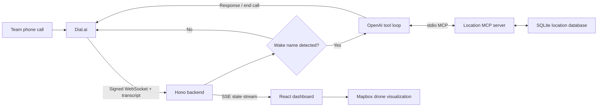

# Combat Dial

**A phone-native autonomous drone operations agent built with Dial.ai.**

Combat Dial listens to a live team call, follows the conversation in real time, and responds when addressed by its wake name. It can resolve named mission locations, calculate coordinates from relative directions, issue a simulated navigation command, and stream the entire decision process to a live map and transcript dashboard.

> [!IMPORTANT]
> Combat Dial is a hackathon prototype. The current `go_to` tool updates the demo interface only; it does not connect to or control a physical aircraft.

## What It Does

- Receives live call events and transcripts from a Dial self-hosted agent.
- Waits for the configured wake name before invoking the AI agent.
- Sends the full conversation context to OpenAI.
- Discovers and executes location tools through a local MCP server.
- Looks up named mission locations stored in SQLite.
- Calculates positions such as "100 meters north of Oscar."
- Publishes transcript, model, and tool activity over Server-Sent Events (SSE).
- Animates the simulated drone to the selected coordinates on a Mapbox 3D map.
- Handles caller interruptions by cancelling the in-progress model response.
- Supports a model-selected `end_call` action for a natural call ending.

## Architecture



### Runtime Flow

1. Dial opens a WebSocket connection at `/<call_id>` and signs it with `X-Dial-Signature`.
2. The backend verifies the signature and mirrors transcript updates to the dashboard.
3. On `response_required`, the backend checks the latest caller turn for the wake name.
4. Unaddressed turns receive an empty response so the call can continue without the agent speaking.
5. Addressed turns are sent to OpenAI with the complete transcript and the available tools.
6. The model can look up locations, calculate coordinates, navigate the simulated drone, or end the call.
7. Tool activity and streamed response drafts are published to the frontend over SSE.
8. A successful `go_to` result animates the drone marker to the requested destination.

## Tech Stack

| Area | Technology |
| --- | --- |
| Voice agent | Dial.ai SDK and self-hosted WebSocket protocol |
| AI | OpenAI Chat Completions with streaming function calls |
| Backend | Node.js, TypeScript, Hono, WebSocket |
| Tool protocol | Model Context Protocol (MCP) over stdio |
| Data | SQLite with `better-sqlite3` |
| Frontend | React 19, TypeScript, Vite |
| Mapping | Mapbox GL JS with satellite imagery and terrain |
| Live updates | Server-Sent Events (SSE) |

## Repository Structure

```text
.
├── backend/
│   ├── server.ts                 # Hono API, Dial WebSocket, and OpenAI loop
│   ├── wake-trigger.ts           # Wake-name detection
│   ├── tool-loop.ts              # Streaming model/tool execution loop
│   ├── location-mcp-server.ts    # MCP location tools
│   ├── location-mcp-client.ts    # Backend MCP client
│   ├── location-store.ts         # SQLite schema and seeded locations
│   ├── position.ts               # Geodesic position calculations
│   └── *.test.ts                 # Backend unit and integration tests
├── frontend/
│   ├── src/App.tsx               # Dashboard, SSE client, and map behavior
│   ├── src/App.css               # Combat operations interface styling
│   └── vite.config.ts            # Local `/api` proxy to the backend
├── transcript.txt                # Demo conversation material
├── judging-criteria.md           # Hackathon judging rubric
└── tasks.md                      # Original implementation checklist
```

## Prerequisites

- [Node.js](https://nodejs.org/) `24.x` (`24.16.0` is pinned in `.nvmrc`)
- npm
- An [OpenAI API key](https://platform.openai.com/api-keys)
- A Dial.ai account and self-hosted agent signing secret
- A public [Mapbox access token](https://docs.mapbox.com/help/getting-started/access-tokens/)
- A public HTTPS/WSS tunnel for receiving Dial connections during local development

## Quick Start

### 1. Clone and select Node.js

```bash
git clone https://github.com/NirMendelson/dial.ai.git
cd dial.ai
nvm install
nvm use
```

### 2. Configure the backend

```bash
cd backend
npm install
cp .env.example .env
```

Edit `backend/.env`:

```env
PORT=8080
OPENAI_API_KEY=your_openai_api_key
OPENAI_MODEL=gpt-4o-mini
DIAL_SIGNING_SECRET=your_dial_signing_secret
AGENT_WAKE_NAME=ברק אחד
LOCATION_DB_PATH=data/locations.db
```

### 3. Configure the frontend

```bash
cd ../frontend
npm install
cp .env.example .env
```

Edit `frontend/.env`:

```env
VITE_MAPBOX_ACCESS_TOKEN=pk.your_public_mapbox_token
```

### 4. Start both applications

Run the backend in one terminal:

```bash
cd backend
npm run dev
```

Run the frontend in another terminal:

```bash
cd frontend
npm run dev
```

Open [http://localhost:5173](http://localhost:5173). The Vite development server proxies `/api` requests to `http://localhost:8080`.

Verify the backend separately with:

```bash
curl http://localhost:8080/health
```

Expected response:

```json
{"status":"ok"}
```

## Connect Dial.ai

Install the Dial CLI:

```bash
curl -fsSL https://getdial.ai/install | bash
```

Then:

1. Expose local port `8080` through a tunnel that supports WebSockets.
2. Create or configure a Dial self-hosted agent.
3. Set its WebSocket server URL to your public `wss://` tunnel URL.
4. Put the matching signing secret in `backend/.env` as `DIAL_SIGNING_SECRET`.
5. Start a call and address the agent using the configured `AGENT_WAKE_NAME`.

Dial appends the call ID to the connection path. The backend accepts connections at `/<call_id>` and rejects upgrades with a missing or invalid `X-Dial-Signature`.

Dial documentation: [docs.getdial.ai](https://docs.getdial.ai/documentation/get-started/introduction)

## Example Command

With the default Hebrew wake name, a caller can say:

```text
ברק 1, עבור לנקודה שנמצאת 100 מטר צפונית לאוסקר.
```

The expected tool sequence is:

```text
lookup_location("אוסקר")
  -> calculate_position(reference, "north", 100)
  -> go_to(latitude, longitude, label)
```

The backend sends the spoken confirmation back to Dial while the frontend displays each tool step and animates the drone marker.

## Configuration

### Backend

| Variable | Required | Default | Description |
| --- | --- | --- | --- |
| `PORT` | No | `8080` | HTTP and WebSocket server port. |
| `OPENAI_API_KEY` | Yes | None | OpenAI API credential read by the SDK. |
| `OPENAI_MODEL` | No | `gpt-4o-mini` | Model used for streamed responses and tool selection. |
| `DIAL_SIGNING_SECRET` | Yes | None | Verifies incoming Dial WebSocket connections. |
| `AGENT_WAKE_NAME` | No | `ברק 1` | Phrase required in the latest caller turn. |
| `LOCATION_DB_PATH` | No | `data/locations.db` | SQLite database path, relative to `backend/`. |

Wake-name matching is Unicode-aware, case-insensitive, and tolerant of punctuation or spacing. For example, `ברק-1` matches `ברק 1`, while `ברק 10` does not.

### Frontend

| Variable | Required | Description |
| --- | --- | --- |
| `VITE_MAPBOX_ACCESS_TOKEN` | Yes | Public token used by Mapbox GL JS in the browser. |

## Agent Tools

The backend launches the location MCP server as a child process, discovers its tools at startup, and exposes them to the model.

| Tool | Purpose |
| --- | --- |
| `list_locations` | Return all named mission locations. |
| `lookup_location` | Resolve a location name to coordinates and a description. |
| `calculate_position` | Calculate coordinates from a reference point, compass direction, and distance in meters. |
| `go_to` | Accept validated coordinates and publish a simulated navigation command. |
| `end_call` | Local backend tool that returns a farewell and asks Dial to end the call. |

Supported directions are `north`, `northeast`, `east`, `southeast`, `south`, `southwest`, `west`, and `northwest`.

## Location Database

SQLite is initialized automatically on backend startup. The seeded scenario currently contains five Hebrew call signs:

| Name | Role |
| --- | --- |
| `מייק` | Northern checkpoint |
| `דלתא` | Southern checkpoint |
| `גולף` | North-south approach road |
| `טנגו` | East-west boundary road |
| `אוסקר` | Home position and operations base |

Seed records are updated idempotently whenever the database opens. To use a different database file, set `LOCATION_DB_PATH`.

## HTTP Endpoints

| Method | Path | Description |
| --- | --- | --- |
| `GET` | `/` | Service name and status. |
| `GET` | `/health` | Health check. |
| `GET` | `/api/transcript` | Current call, transcript, locations, draft, and activity state. |
| `GET` | `/api/transcript/stream` | SSE stream of the same state with 15-second keepalives. |
| WebSocket | `/<call_id>` | Signed Dial self-hosted agent connection. |

## Development Commands

### Backend

```bash
cd backend
npm run dev        # Watch mode
npm start          # Run once
npm test           # Unit and MCP integration tests
npm run typecheck  # TypeScript validation
```

### Frontend

```bash
cd frontend
npm run dev      # Vite development server
npm run build    # TypeScript and production build
npm run lint     # ESLint
npm run preview  # Preview the production build
```

## Testing

The backend test suite covers:

- Wake-name matching and latest-turn selection.
- Geodesic calculations in all supported directions.
- Invalid coordinate and distance handling.
- SQLite seeding, updates, and idempotency.
- MCP tool discovery and execution.
- Multi-round model tool calls, failures, navigation, and call ending.

Run the full project checks with:

```bash
(cd backend && npm test && npm run typecheck)
(cd frontend && npm run lint && npm run build)
```

## Troubleshooting

### `better-sqlite3` fails after changing Node versions

Rebuild the native dependency:

```bash
cd backend
npm rebuild better-sqlite3
```

### The dashboard says it is reconnecting

Confirm that the backend is running on port `8080` and that `curl http://localhost:8080/health` succeeds. In development, the frontend relies on the Vite `/api` proxy.

### The map does not load

Confirm `frontend/.env` contains a valid public Mapbox token, then restart the Vite server.

### The agent never responds

Check that:

- The latest caller turn includes `AGENT_WAKE_NAME`.
- Dial and the backend use the same signing secret.
- The tunnel forwards WebSocket upgrades to port `8080`.
- `OPENAI_API_KEY` is valid and the configured model is available.

### Location changes do not appear

Restart the backend after changing the seed data. The frontend receives the current location list from the backend when the SSE state updates.

## Security and Safety Notes

- Never commit `.env` files or API keys.
- Use a public Mapbox token with appropriate URL and scope restrictions.
- Keep Dial signature verification enabled for every WebSocket connection.
- Treat transcripts and call metadata as sensitive operational data.
- Add authentication, authorization, audit logging, command approval, geofencing, and hardware fail-safes before integrating any real vehicle.
- The included navigation command is intentionally a simulation contract, not a flight-control implementation.

## Project Context

Combat Dial was built for the **My Agent Has A Phone** hackathon in Tel Aviv on June 11-12, 2026. The project explores a phone call as a real-time control and coordination interface: no dedicated operator application is required to address the agent, while the web dashboard provides shared situational awareness for the team.
